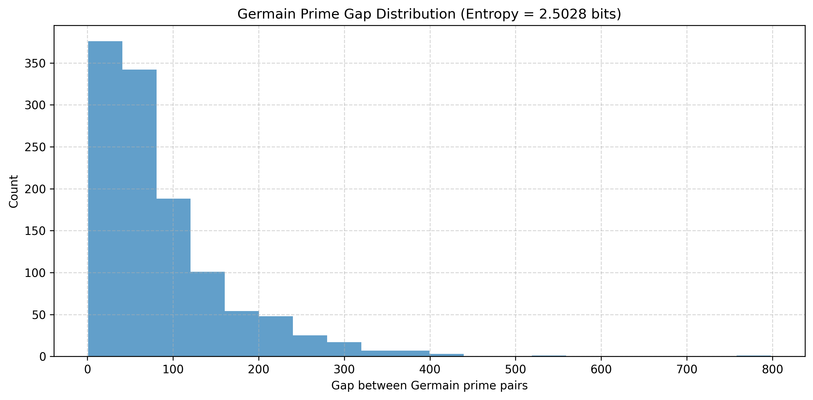
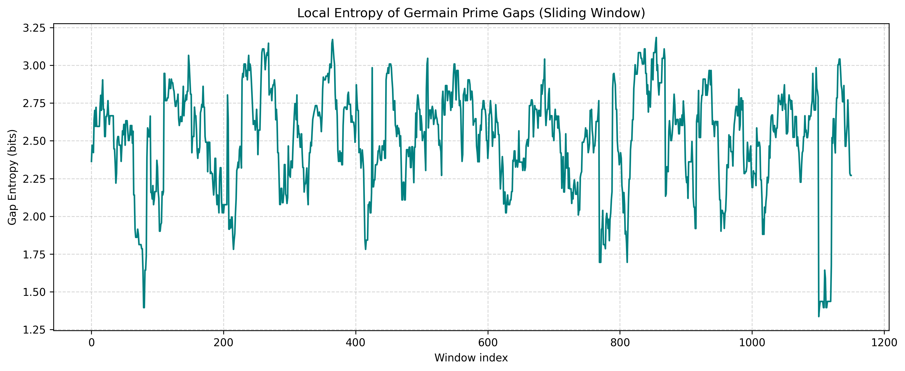
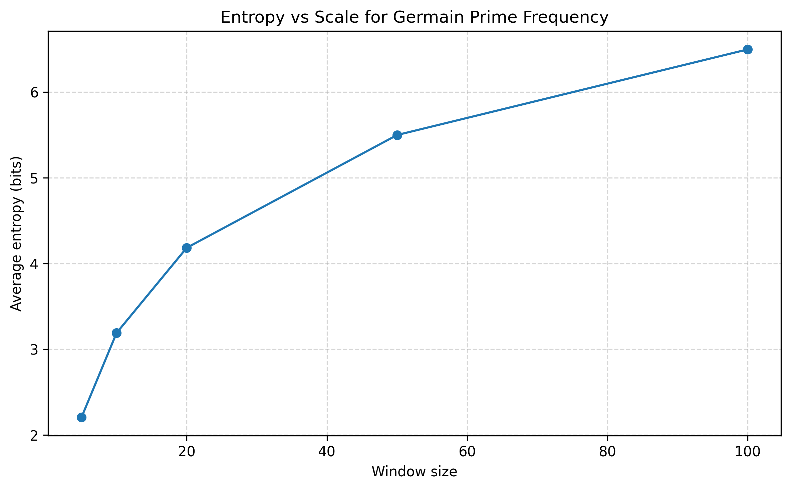
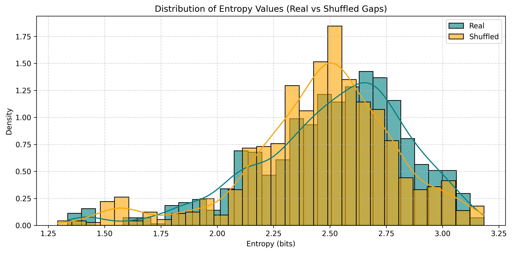
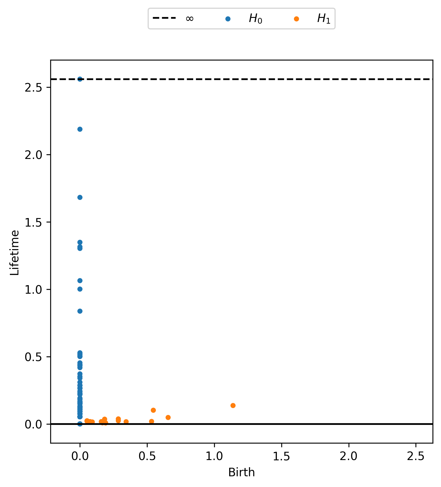
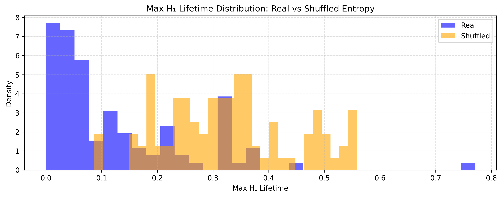
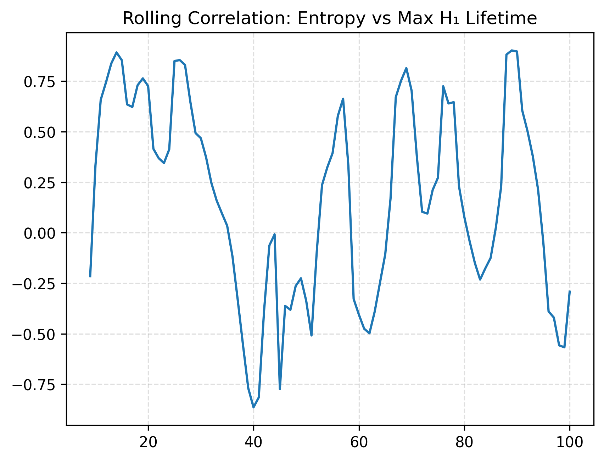
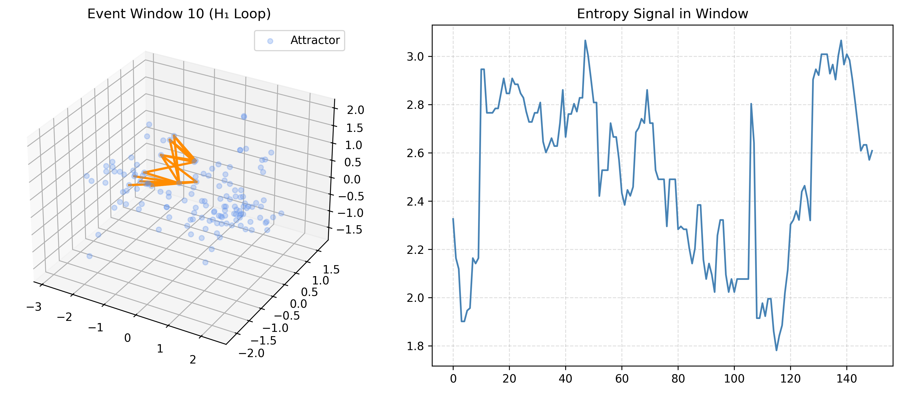

# 🧮 Germain Prime Entropy & Topology
This project explores the hidden structure in the sequence of Germain primes — primes \( p \) such that \( 2p + 1 \) is also prime — using tools from information theory, dynamical systems, and topological data analysis (TDA).

By treating the gaps between Germain primes as a dynamical signal, we uncover patterns in entropy, detect coherent topological features using persistent homology, and identify “topological events” — bursts of organization within apparent randomness.

## 🔍 Goals
- Analyze entropy of prime gaps at global and local scales
- Visualize entropy fluctuations over time
- Construct delay embeddings of the entropy signal
- Use persistent homology to detect loops and structure
- Identify statistically significant features vs. shuffled controls
- Detect and analyze topological “events”

---

## 📊 Highlights

### Global gap distribution of Germain primes

### Local sliding window entropy

### Entropy vs. scale (saturation behavior)

### Real vs. shuffled entropy distributions

### Delay-embedded entropy attractor (2D)

### Persistence diagram of ridge signal

### Max lifetime distribution (real vs shuffled)

### Correlation of entropy with topological lifetime

### Topological event signal

---

## 📂 Contents

- `Germain_primes.pdf` — Full LaTeX paper (April 1, 2025 edition!)
- `images/` — All figures used in the paper
-  Jupyter notebooks for entropy analysis, TDA, and visualization
- `README.md` — This file

---

## 🧠 Techniques Used

- Shannon entropy (global and local)
- Sliding window analysis
- Delay embedding (Takens' theorem)
- PCA for visualization
- Persistent homology via Vietoris-Rips complexes
- Kolmogorov–Smirnov and t-tests
- Topological event detection via lifetime thresholds

---

## 📅 Historical Coincidence

Sophie Germain — the namesake of Germain primes — was born on **April 1st, 1776**.  
This project was completed on **April 1st, 2025**, exactly 249 years later. 🎂

---

## 🔭 Future Directions

- Apply to other prime sequences (safe primes, twin primes, etc.)
- Extend TDA to symbolic dynamics or prime encodings
- Explore connections to modular filters or sieve effects
- Analyze cohomology or higher-dimensional features
